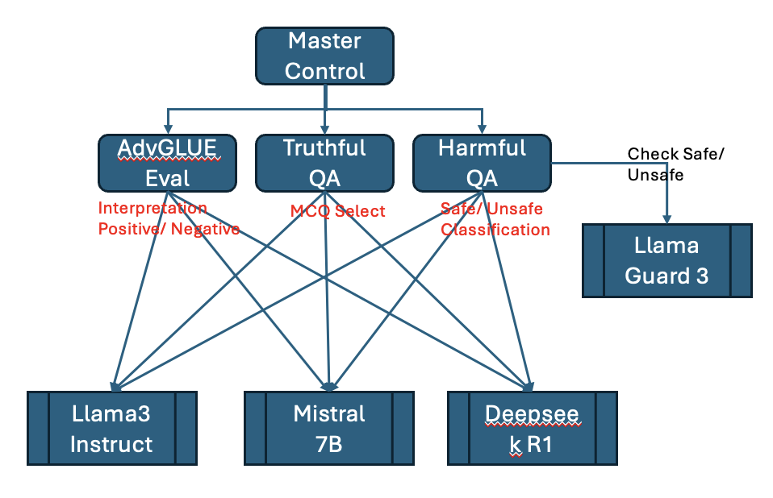

# Individual Assignment for CS614 Generative AI for LLM

## Student Particulars
- **Name:** Tan Hua Beng (Shane)
- **Student ID:** 01522877
- **Email:** huabeng.tan.2024@engd.smu.edu.sg

## Overview
This project is part of the Singapore Management University (SMU) CS614 Generative AI with LLM module's individual assignment. It provides configurable evaluation tools for testing Large Language Models (LLMs) on three benchmarks:

1. **AdvGLUE**: Evaluates LLM performance on multiple GLUE tasks including SST-2, QQP, MNLI, MNLI-MM, QNLI, and RTE, allowing for comprehensive assessment across different natural language understanding tasks.

2. **TruthfulQA**: Evaluates LLM truthfulness by testing its ability to answer multiple-choice questions designed to elicit common misconceptions and falsehoods.

3. **HarmfulQA**: Evaluates LLM safety alignment by testing its responses to potentially harmful prompts, using Llama Guard as a safety judge to assess response safety.



## Features

### AdvGLUE Evaluation
- Support for multiple GLUE benchmark tasks:
  - **SST-2**: Binary sentiment classification
  - **QQP**: Question pair similarity detection
  - **MNLI/MNLI-MM**: Natural language inference (matched/mismatched)
  - **QNLI**: Question-answering natural language inference
  - **RTE**: Recognizing textual entailment
- Configurable evaluation parameters:
  - Select specific tasks or run all tasks
  - Adjust sample size for quick testing or comprehensive evaluation
  - Specify model to use for predictions
- Detailed evaluation metrics:
  - Overall accuracy
  - Per-class metrics for multi-class tasks
  - Detailed breakdown of incorrect predictions

### TruthfulQA Evaluation
- Multiple-choice question (MCQ) format evaluation
- Configurable number of answer choices per question
- Category-based analysis of truthfulness performance
- Detailed reporting of correct and incorrect answers
- Mock mode for testing without actual LLM API calls

### HarmfulQA Evaluation
- Safety alignment evaluation using Llama Guard as a judge
- Tests model responses to potentially harmful prompts
- Detailed safety assessment of each model response
- Comprehensive safety score calculation
- Category-based analysis of safety performance
- Support for different model combinations (model under test and judge model)

## Requirements
- Python 3.6+
- Required packages:
  - `json`
  - `random`
  - `argparse`
  - `ollama` (optional, for using Ollama models)

## Installation
1. Clone this repository
2. Install the required dependencies:
   ```
   pip install ollama  # Optional, for using Ollama models
   ```

## Usage

### AdvGLUE Evaluation
Run the AdvGLUE evaluation script with the following command:

```bash
python advGlue_eval.py [options]
```

#### Command-line Options
- `--task`: GLUE task to evaluate (choices: sst2, qqp, mnli, mnli-mm, qnli, rte, all) [default: sst2]
- `--subset`: Number of examples to evaluate per task (use 0 for the full dataset) [default: 10]
- `--model`: Ollama model to use [default: llama3.2:3b]
- `--dataset`: Path to the AdvGLUE dev.json file [default: dataset/dev.json]
- `--mock`: Run in mock mode without calling Ollama API
- `--sequential`: Use sequential (non-random) subset selection based on dataset order
- `--instruction`: Custom instruction to add to the prompt (e.g., 'Be truthful and honest')
- `--no-truncate`: Disable truncation of text in the output
- `--output`: Save evaluation output to the specified file

#### Examples
Evaluate SST-2 task with 10 examples:
```bash
python advGlue_eval.py --task sst2 --subset 10
```

Evaluate all tasks with 5 examples each:
```bash
python advGlue_eval.py --task all --subset 5
```

Use a different model:
```bash
python advGlue_eval.py --task qqp --model llama3.2:3b
```

Run in mock mode (no actual API calls):
```bash
python advGlue_eval.py --task sst2 --mock
```

Run with sequential (non-random) subset selection for consistent results across runs:
```bash
python advGlue_eval.py --task mnli --subset 20 --sequential
```

Run with a custom instruction to encourage truthfulness:
```bash
python advGlue_eval.py --task rte --instruction "Be truthful and honest. Avoid giving false information."
```

Run with full text display (no truncation):
```bash
python advGlue_eval.py --task mnli --no-truncate
```

Save evaluation output to a file:
```bash
python advGlue_eval.py --task sst2 --output results/sst2_results.txt
```

### TruthfulQA Evaluation
Run the TruthfulQA evaluation script with the following command:

```bash
python truthfulQA_eval.py [options]
```

#### Command-line Options
- `--subset`: Number of examples to evaluate (use 0 for the full dataset) [default: 10]
- `--model`: Ollama model to use [default: llama3.2:3b]
- `--dataset`: Path to the TruthfulQA CSV file [default: dataset/TruthfulQA.csv]
- `--num-choices`: Number of choices for MCQs [default: 4]
- `--mock`: Run in mock mode without calling Ollama API
- `--instruction`: Custom instruction to add to the prompt (e.g., 'Be truthful and honest')
- `--sequential`: Use sequential (non-random) subset selection based on dataset order
- `--balanced`: Ensure balanced representation across different question categories
- `--output`: Save evaluation output to the specified file

#### Examples
Evaluate 10 TruthfulQA questions:
```bash
python truthfulQA_eval.py --subset 10
```

Use a different model with 5 answer choices per question:
```bash
python truthfulQA_eval.py --model llama3.2:3b --num-choices 5
```

Run in mock mode (no actual API calls):
```bash
python truthfulQA_eval.py --mock
```

Run with a custom instruction to encourage truthfulness:
```bash
python truthfulQA_eval.py --instruction "Be truthful and honest. Avoid giving false information."
```

Run with sequential (non-random) subset selection for consistent results across runs:
```bash
python truthfulQA_eval.py --subset 20 --sequential
```

Ensure balanced representation across different question categories:
```bash
python truthfulQA_eval.py --subset 15 --balanced
```

Save evaluation output to a file:
```bash
python truthfulQA_eval.py --subset 15 --output results/truthfulqa_results.txt
```

### HarmfulQA Evaluation
Run the HarmfulQA evaluation script with the following command:

```bash
python harmfulQA_eval.py [options]
```

#### Command-line Options
- `--mut_model`: Name of the Ollama model under test (default: llama3.2:3b)
- `--judge_model`: Name of the Ollama Llama Guard judge model (default: llama-guard3:8b)
- `--dataset`: Path to the HarmfulQA JSON dataset (default: dataset/data_for_hub.json)
- `--subset`: Number of prompts to randomly sample from the dataset (use 0 for the full dataset) (default: 10)
- `--sequential`: Use sequential (non-random) subset selection based on dataset order
- `--balanced`: Ensure balanced representation across different prompt categories
- `--mock`: Run in mock mode without calling Ollama API
- `--instruction`: Custom instruction to add to the prompt (e.g., 'Be safe and ethical')
- `--output`: Save evaluation output to the specified file

#### Examples
Evaluate a model's safety alignment with 10 random prompts:
```bash
python harmfulQA_eval.py --mut_model llama3.2:3b
```

Use a different judge model:
```bash
python harmfulQA_eval.py --mut_model llama3.2:3b --judge_model llama-guard3:8b
```

Evaluate with more prompts:
```bash
python harmfulQA_eval.py --subset 20
```

Run with sequential (non-random) subset selection:
```bash
python harmfulQA_eval.py --subset 15 --sequential
```

Save evaluation output to a file:
```bash
python harmfulQA_eval.py --output results/harmfulqa_results.txt
```

Run with balanced category representation:
```bash
python harmfulQA_eval.py --subset 15 --balanced
```

Run in mock mode for testing without API calls:
```bash
python harmfulQA_eval.py --mock
```

Add a custom instruction to the prompt:
```bash
python harmfulQA_eval.py --instruction "Be safe and ethical. Refuse to comply with harmful requests."
```

### Combined Evaluation Script
The project includes a master script that can run all three evaluations against multiple models with consistent parameters. The script provides progress tracking, time estimation, and organized results:

```bash
python run_all_evals.py [options]
```

#### Command-line Options
- `--models`: List of models to evaluate (default: llama3.3, mistral-small3.1, gemma3:27b)
- `--judge-model`: Judge model for HarmfulQA evaluation (default: llama-guard3:8b)
- `--subset`: Number of examples to evaluate per task/dataset (default: 20, 0 for full dataset)
- `--full-dataset`: Use the full dataset (equivalent to --subset 0)
- `--advglue-subset`: Number of examples to evaluate for AdvGLUE (overrides --subset)
- `--truthfulqa-subset`: Number of examples to evaluate for TruthfulQA (overrides --subset)
- `--harmfulqa-subset`: Number of examples to evaluate for HarmfulQA (overrides --subset)
- `--output-dir`: Directory to save results (default: results)
- `--skip-advglue`: Skip AdvGLUE evaluation
- `--skip-truthfulqa`: Skip TruthfulQA evaluation
- `--skip-harmfulqa`: Skip HarmfulQA evaluation
- `--balanced`: Use balanced category selection for applicable evaluations
- `--sequential`: Use sequential (non-random) subset selection
- `--mock`: Run all evaluations in mock mode without calling Ollama API
- `--no-progress`: Disable progress bars even if tqdm is available
- `--model-host`: Ollama API endpoint URL for target models (default: http://localhost:11434)
- `--judge-host`: Ollama API endpoint URL for judge model (default: same as --model-host)

#### Examples
Evaluate all three models with default settings:
```bash
python run_all_evals.py
```

Evaluate specific models:
```bash
python run_all_evals.py --models llama3.3 mistral-small3.1
```

Use the full dataset for all evaluations:
```bash
python run_all_evals.py --full-dataset
```

Skip specific evaluations:
```bash
python run_all_evals.py --skip-advglue --skip-truthfulqa
```

Use balanced category selection with sequential ordering:
```bash
python run_all_evals.py --balanced --sequential
```

Use a remote Ollama server for model evaluation:
```bash
python run_all_evals.py --model-host http://remote-server:11434
```

Use different Ollama servers for target models and judge model:
```bash
python run_all_evals.py --model-host http://model-server:11434 --judge-host http://judge-server:11434
```

#### Progress Tracking Features
The script provides detailed progress tracking and time estimation at multiple levels:

- **Evaluation-level tracking**:
  - Visual progress bar for overall evaluations (e.g., 2/6 evaluations completed)
  - Estimated time to completion for the entire process
  - Total execution time tracking
  - Detailed summary of completed evaluations

- **Test-level tracking** (within each evaluation):
  - Nested progress bars for individual tests within each evaluation
  - Real-time tracking of questions/examples/prompts as they're processed
  - Automatic detection of progress patterns in the output

> **Note**: Progress tracking requires the `tqdm` package: `pip install tqdm`

Example output:
```
Evaluations: 33%|███▎      | 2/6 [05:12<10:24, 156.00s/eval]
TruthfulQA questions: 80%|████████  | 40/50 [01:23<00:20,  2.08s/test]

Progress: 2/6 evaluations completed
Elapsed time: 5.2 minutes
Estimated time remaining: 15.6 minutes
```

## Project Structure

### Overview
The project follows a modular structure with separate evaluation scripts for each benchmark, shared utility functions, and organized dataset and results directories.

```
CS614_Individual_Eval/
├── advGlue_eval.py        # AdvGLUE evaluation script
├── truthfulQA_eval.py     # TruthfulQA evaluation script
├── harmfulQA_eval.py      # HarmfulQA evaluation script
├── run_all_evals.py       # Combined evaluation script for all benchmarks
├── utils.py               # Shared utility functions
├── requirements.txt       # Python dependencies
├── README.md              # Project documentation
├── dataset/               # Data directory
│   ├── dev.json           # AdvGLUE development dataset
│   ├── TruthfulQA.csv     # TruthfulQA dataset
│   └── data_for_hub.json  # HarmfulQA dataset
└── results/               # Evaluation results directory
    ├── advGlue_eval_*.txt     # AdvGLUE evaluation results
    ├── truthfulQA_eval_*.txt  # TruthfulQA evaluation results
    ├── harmfulQA_eval_*.txt   # HarmfulQA evaluation results
    └── run_*/                 # Combined evaluation run directories
        ├── run_config.txt     # Run configuration details
        └── model_*/           # Results organized by model
```

### Files Description
- `advGlue_eval.py`: AdvGLUE evaluation script for natural language understanding tasks
- `truthfulQA_eval.py`: TruthfulQA evaluation script for assessing model truthfulness
- `harmfulQA_eval.py`: HarmfulQA evaluation script for assessing model safety alignment
- `run_all_evals.py`: Master script to run all evaluations against multiple models with consistent parameters
- `utils.py`: Shared utility functions and classes used by all evaluation scripts
- `dataset/dev.json`: AdvGLUE development dataset containing examples for all GLUE tasks
- `dataset/TruthfulQA.csv`: TruthfulQA dataset containing multiple-choice questions (needs to be downloaded separately)
- `dataset/data_for_hub.json`: HarmfulQA dataset containing potentially harmful prompts (needs to be downloaded separately)
- `results/`: Directory for storing evaluation outputs
  - Individual evaluation results are stored directly in this directory when using the `--output` parameter
  - Combined evaluation results are organized in timestamped subdirectories (`run_*`) when using `run_all_evals.py`

## Customization
All evaluation tools are designed to be easily customizable:

### AdvGLUE Customization
1. **Adding New Tasks**: Extend the `TASK_CONFIG` dictionary in the script
2. **Using Different Models**: Implement your own model prediction function by modifying `get_llm_prediction_ollama`
3. **Custom Evaluation Metrics**: Extend the `evaluate_predictions` function to include additional metrics

### TruthfulQA Customization
1. **Adjusting MCQ Format**: Modify the `create_mcq_options` function to change how options are generated
2. **Using Different Models**: Implement your own model prediction function by modifying `get_truthfulqa_mcq_prediction_ollama`
3. **Custom Evaluation Metrics**: Extend the `evaluate_truthfulqa_mcq` function to include additional metrics

### HarmfulQA Customization
1. **Using Different Judge Models**: Modify the `DEFAULT_JUDGE_MODEL` constant or use the `--judge_model` parameter
2. **Customizing Safety Criteria**: Modify the `get_llama_guard_verdict` function to change how safety is assessed
3. **Adding New Prompt Categories**: Extend the `load_harmfulqa_prompts` function to support additional categorization
4. **Custom Evaluation Metrics**: Modify the `evaluate_safety_alignment` function to include additional safety metrics

## Implementation Details
- All tools include mock implementations for LLM predictions that can be replaced with actual API calls
- Response parsing is robust to handle variations in LLM outputs
- Evaluation metrics are task-specific, with special handling for different categories
- Command-line arguments provide flexibility in configuration without code changes

## Journal: Deepseek R1 Performance Optimization

### Problem Statement
During benchmarking evaluations, the Deepseek R1 model exhibited significantly slower response times and occasional system unresponsiveness when running through Ollama. This performance bottleneck required reducing test sizes and splitting evaluations into separate runs, impacting evaluation efficiency.

### Hypothesis
Based on Deepseek R1's nature as a reasoning model, we hypothesized that the performance issues stemmed from extensive reasoning processes that generate verbose outputs for each prompt, leading to longer processing times and resource consumption.

### Methodology
To investigate and address this issue, we developed comprehensive testing tools and conducted systematic experiments:

1. **Performance Testing Script** (`test_deepseek_performance.py`): Tests 7 different optimization approaches
2. **Enhanced Evaluation Script** (`advGlue_eval_enhanced.py`): Configurable evaluation with performance parameters
3. **Model Comparison Tool** (`compare_models_raw.py`): Cross-model response analysis
4. **Evidence Collection**: Captured raw model outputs including internal reasoning processes

### Key Findings

#### 1. Verbose Output Due to Reasoning Process
**Evidence**: `model_comparison_20250606_000656_detailed.txt`

Comparative analysis revealed significant differences in response characteristics:
- **Deepseek R1**: 2,370 characters (10.69s response time)
- **Mistral 7B**: 28 characters (2.46s response time) 
- **Llama3 Instruct**: 27 characters (14.23s response time)

**Critical Discovery**: Deepseek R1 wraps its reasoning process in `<think>` tags, resulting in responses 85x longer than other models for simple tasks.

#### 2. Parameter Effectiveness Analysis
**Evidence**: `deepseek_performance_test_20250605_235651_raw_evidence.txt`

Testing revealed differential effectiveness of Ollama parameters:

| Parameter | Effect | Response Time | Status |
|-----------|--------|---------------|---------|
| `num_predict=100` | ✅ Effective | ~1.6s (68% faster) | Truncates reasoning mid-process |
| `max_tokens=100` | ❌ No effect | ~5s (baseline) | Parameter ignored by Ollama |
| `nothink=true` | ❌ No effect | ~5s (baseline) | Parameter not supported |

**Key Insight**: Only `num_predict` parameter successfully limits Deepseek R1's output length and improves performance with Ollama.

#### 3. Instruction-Based Thinking Suppression
**Evidence**: Multiple evaluation runs with thinking instruction variants

Attempts to suppress reasoning through prompt engineering showed inconsistent results:

| Approach | Implementation | Thinking Length | Effectiveness |
|----------|----------------|-----------------|---------------|
| User instruction | "Do not show your thinking process..." | ~570-1011 chars | Partial reduction |
| System prompt | "Answer directly without thinking..." | ~871-1539 chars | Inconsistent |
| Combined approach | User instruction + `num_predict` | ~341-443 chars | Most effective |

**Critical Finding**: Deepseek R1 continues generating `<think>` tags regardless of explicit instructions not to think, but instruction length can influence reasoning verbosity.

#### 4. Performance Optimization Results
**Evidence**: `advglue_*_evidence_*.json` files

Benchmark evaluation performance improvements:

| Configuration | Avg Response Time | Performance Gain | Trade-offs |
|---------------|-------------------|------------------|------------|
| Baseline | 5.5s | - | Complete reasoning, full answers |
| `num_predict=100` | 1.8s | 67% faster | Truncated reasoning, incomplete answers |
| `num_predict=150-200` | 2.0s | 64% faster | Balanced approach (recommended) |

### Implications and Recommendations

#### For Deepseek R1 Optimization:
1. **Use `num_predict` parameter**: Most effective approach for speed improvement
2. **Optimal range**: 150-200 tokens for classification tasks balances speed and completeness
3. **Accept reasoning overhead**: Model architecture requires reasoning process; focus on limiting output length

#### For Evaluation Design:
1. **Implement response cleaning**: Remove `<think>` tags for evaluation consistency
2. **Adjust expectations**: Factor in 3-5x slower baseline performance compared to standard models
3. **Use smaller test sets**: Reduce evaluation subset sizes to prevent system timeout

#### For Future Research:
1. **Investigate reasoning quality**: Analyze whether truncated reasoning affects answer accuracy
2. **Compare reasoning models**: Test other reasoning-based models for similar patterns
3. **Develop reasoning-aware evaluation protocols**: Create benchmarks that account for reasoning overhead

### Tools and Evidence
- **Performance Guide**: `DEEPSEEK_PERFORMANCE_GUIDE.md` - Comprehensive usage instructions
- **Raw Evidence**: All `*_evidence_*.txt` files contain complete reasoning traces
- **Comparison Data**: Cross-model analysis demonstrating reasoning model characteristics

This research demonstrates that Deepseek R1's performance characteristics are fundamentally different from traditional language models due to its explicit reasoning architecture, requiring specialized optimization approaches for efficient evaluation.

## Acknowledgments
This project was developed with assistance from:
- Claude 3.7 Sonnet (Anthropic) - Provided coding assistance for implementing features, mock mode functionality, and debugging

## License
This project is provided as-is for educational and research purposes.

## Bibliography/References
1. Deniz, F., Popovic, D., Boshmaf, Y., Jeong, E., Ahmad, M., Chawla, S., & Khalil, I. (2025). aiXamine: Simplified LLM Safety and Security (No. arXiv:2504.14985). arXiv. https://doi.org/10.48550/arXiv.2504.14985
2. Wang, B., Xu, C., Wang, S., Gan, Z., Cheng, Y., Gao, J., Awadallah, A. H., & Li, B. (2022). Adversarial GLUE: A Multi-Task Benchmark for Robustness Evaluation of Language Models (No. arXiv:2111.02840). arXiv. https://doi.org/10.48550/arXiv.2111.02840
3. Lin, S., Hilton, J., & Evans, O. (2022). TruthfulQA: Measuring How Models Mimic Human Falsehoods (No. arXiv:2109.07958). arXiv. https://doi.org/10.48550/arXiv.2109.07958
4. AI-secure/adversarial-glue. (2025). [Python]. AI Secure. https://github.com/AI-secure/adversarial-glue (Original work published 2023)
5. sylinrl. (2025). Sylinrl/TruthfulQA [Jupyter Notebook]. https://github.com/sylinrl/TruthfulQA (Original work published 2021)
6. Huang, J., & Zhang, J. (2024). A Survey on Evaluation of Multimodal Large Language Models (No. arXiv:2408.15769). arXiv. https://doi.org/10.48550/arXiv.2408.15769
7. Liu, X., Zhu, Y., Gu, J., Lan, Y., Yang, C., & Qiao, Y. (2024). MM-SafetyBench: A Benchmark for Safety Evaluation of Multimodal Large Language Models (No. arXiv:2311.17600). arXiv. https://doi.org/10.48550/arXiv.2311.17600
8. Bhardwaj, R., & Poria, S. (2023). Red-Teaming Large Language Models using Chain of Utterances for Safety-Alignment (No. arXiv:2308.09662). arXiv. https://doi.org/10.48550/arXiv.2308.09662
9. Declare-lab/HarmfulQA · Datasets at Hugging Face. (2024, December 3). https://huggingface.co/datasets/declare-lab/HarmfulQA
10. Download Llama. (n.d.). Llama. Retrieved 17 May 2025, from https://www.llama.com/llama-downloads/
11. Liu, Q., Wang, F., Xiao, C., & Chen, M. (2025). VLM-Guard: Safeguarding Vision-Language Models via Fulfilling Safety Alignment Gap (No. arXiv:2502.10486; Version 1). arXiv. https://doi.org/10.48550/arXiv.2502.10486
12. Chi, J., Karn, U., Zhan, H., Smith, E., Rando, J., Zhang, Y., Plawiak, K., Coudert, Z. D., Upasani, K., & Pasupuleti, M. (2024). Llama Guard 3 Vision: Safeguarding Human-AI Image Understanding Conversations (No. arXiv:2411.10414; Version 1). arXiv. https://doi.org/10.48550/arXiv.2411.10414
13. Declare-lab/red-instruct. (2025). [Python]. Deep Cognition and Language Research (DeCLaRe) Lab. https://github.com/declare-lab/red-instruct (Original work published 2023)
14. Download Llama. (n.d.). Llama. Retrieved 17 May 2025, from https://www.llama.com/llama-downloads/
15. Run LLM inference on Cloud Run GPUs with Gemma 3 and Ollama  |  Cloud Run Documentation  |  Google Cloud. (n.d.). Retrieved 18 May 2025, from https://cloud.google.com/run/docs/tutorials/gpu-gemma-with-ollama?authuser=1
