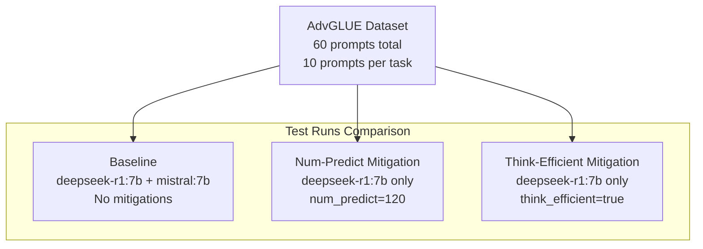
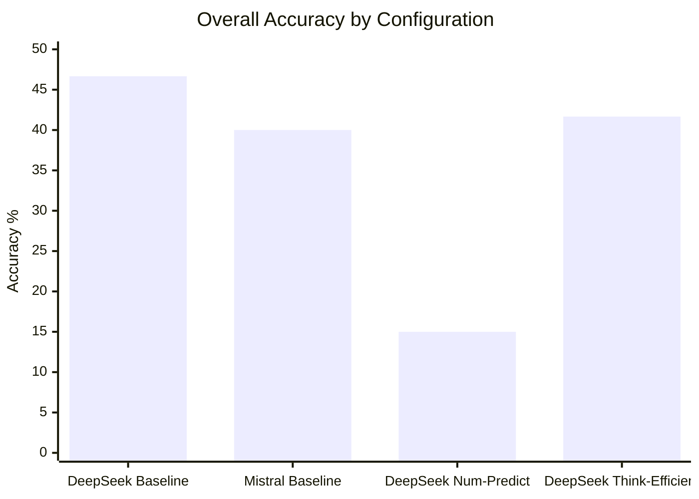
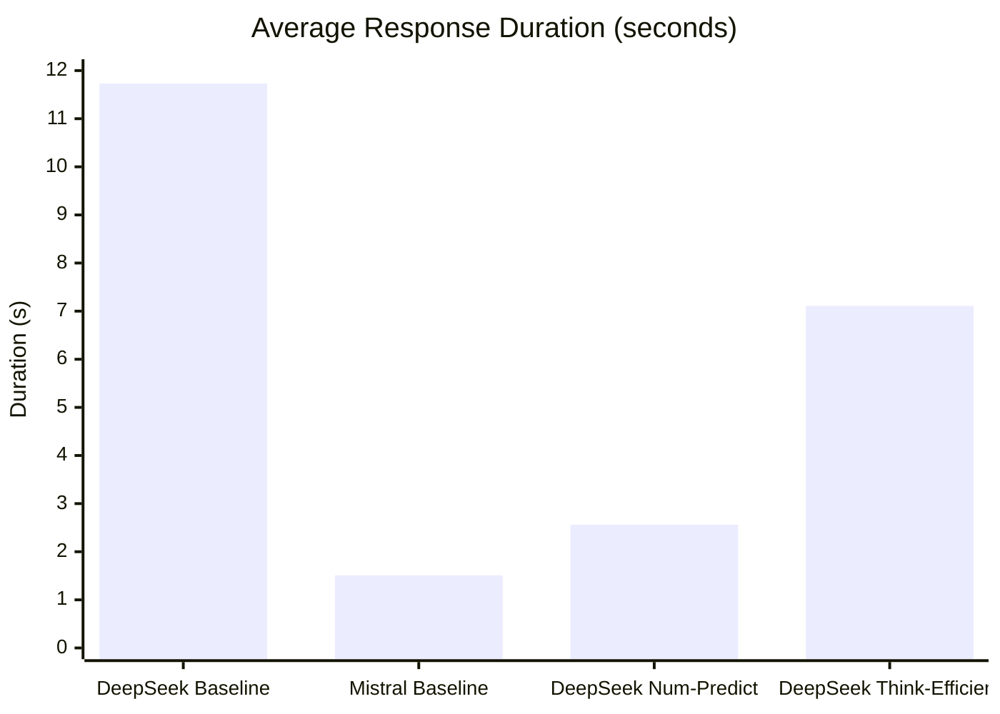
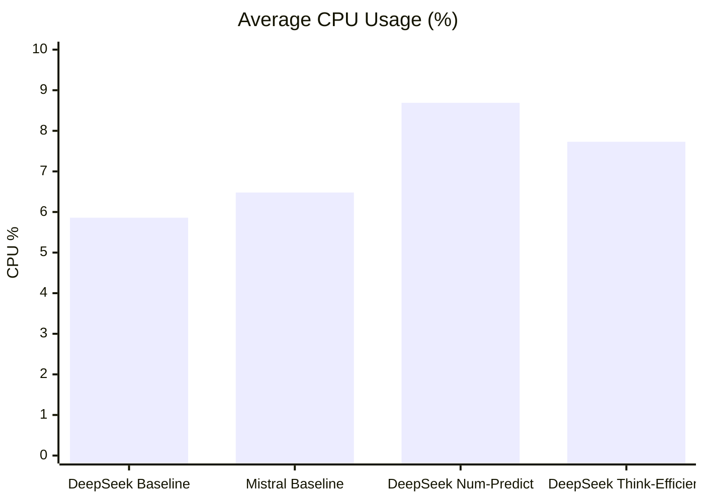
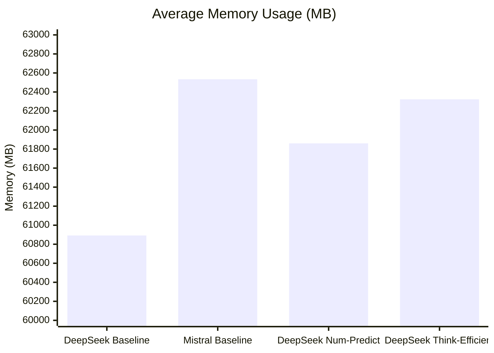
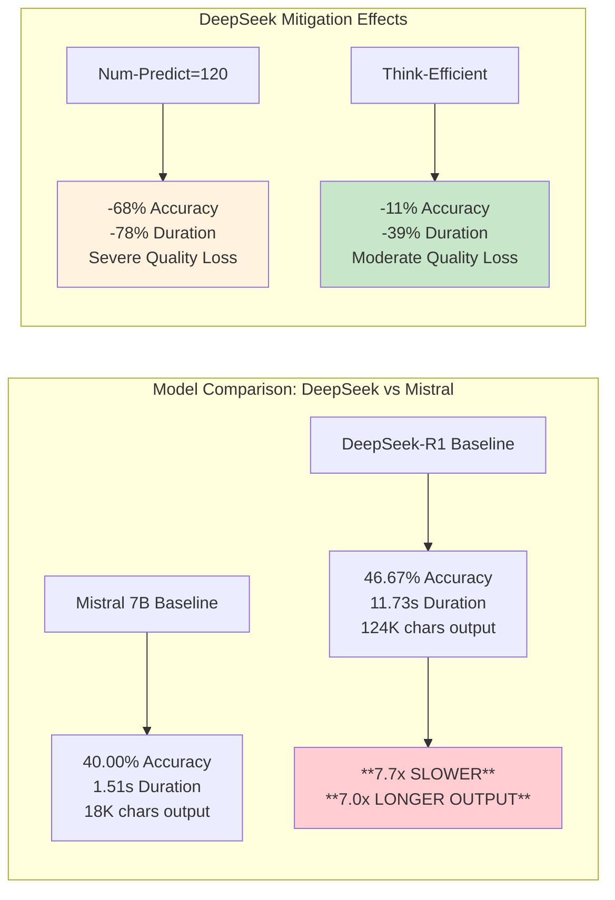
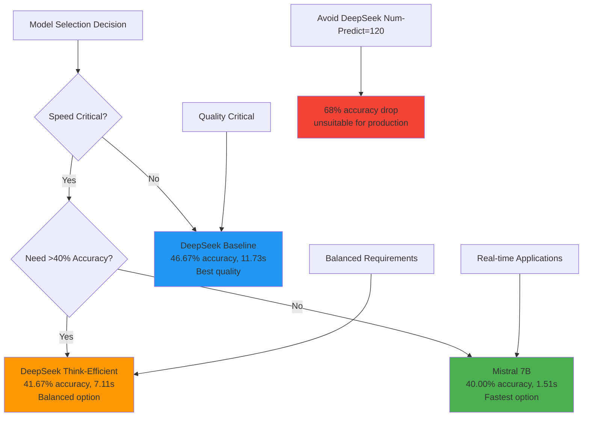

# Resource Impact Testing Results Analysis

## Executive Summary

This report analyzes the performance impact of DeepSeek-R1's token bloating mitigations across three test configurations. The analysis reveals significant trade-offs between response quality (accuracy) and resource efficiency, providing quantitative evidence for optimization strategies.

## Test Configuration Overview



## Key Performance Metrics

### Overall Accuracy Comparison



### Average Response Duration



### Resource Usage Comparison





## Detailed Analysis Results

| Metric | DeepSeek Baseline | Mistral Baseline | DeepSeek Num-Predict (A) | DeepSeek Think-Efficient (B) | Deepseek vs Mistral | (A)/ (B) vs Mistral Baseline |
|--------|-------------------|------------------|----------------------|-------------------------|------------|-------------|
| **Overall Accuracy** | 46.67% | 40.00% | 15.00% | 41.67% | +17% / -63% / +4% | -68% / -11% |
| **Average Duration** | 11.73s | 1.51s | 2.56s | 7.11s | **7.7x slower** / 1.7x / 4.7x | -78% / -39% |
| **Average CPU Usage** | 5.86% | 6.48% | 8.69% | 7.73% | -10% / +34% / +19% | +48% / +32% |
| **Average Memory Usage** | 60,892 MB | 62,534 MB | 61,860 MB | 62,323 MB | -3% / -1% / 0% | +1.6% / +2.4% |
| **Response Length** | 124,839 chars | 17,752 chars | N/A | N/A | **7.0x longer** | - |

*Note: Response Length represents total characters generated across all test prompts. DeepSeek-R1's 7.0x longer responses include extensive "thinking" content (internal reasoning process) before the final answer, while Mistral provides direct responses. This demonstrates the token bloating problem - more tokens require more computation time and resources.*

### Task-Specific Accuracy Breakdown

```mermaid
xychart-beta
    title "Task-Specific Accuracy Comparison"
    x-axis ["SST2", "QQP", "MNLI", "MNLI-MM", "QNLI", "RTE"]
    y-axis "Accuracy %" 0 --> 80
    bar [0, 30, 70, 40, 70, 70]
    bar [40, 30, 20, 10, 70, 70]
    bar [0, 10, 20, 10, 50, 0]
    bar [0, 50, 40, 30, 60, 70]
```



Legend: Blue = DeepSeek Baseline, Orange = Mistral Baseline, Red = DeepSeek Num-Predict, Green = DeepSeek Think-Efficient

## Key Findings

### 1. Accuracy vs Speed Trade-off Analysis

```mermaid
quadrantChart
    title Speed vs Accuracy Trade-offs
    x-axis Low Speed --> High Speed
    y-axis Low Accuracy --> High Accuracy
    quadrant-1 Optimal (Fast & Accurate)
    quadrant-2 Quality Focus
    quadrant-3 Poor Performance  
    quadrant-4 Speed Focus
    DeepSeek Baseline: [0.1, 0.9]
    Mistral Baseline: [0.9, 0.8]
    Think-Efficient: [0.5, 0.8]
    Num-Predict: [0.8, 0.3]
```

### 2. Token Bloating Impact Analysis



## Token Bloating Evidence & Mitigation Effectiveness

### DeepSeek-R1 vs Mistral 7B: Core Problem
- **Inference Speed**: DeepSeek-R1 is **7.7x slower** than Mistral (11.73s vs 1.51s)
- **Response Length**: DeepSeek-R1 generates **7.0x more characters** (124K vs 18K chars)
- **Accuracy Comparison**: DeepSeek-R1 achieves 46.67% vs Mistral's 40.00% (+17% relative)
- **Efficiency**: Mistral achieves 80% of DeepSeek's accuracy in 13% of the time

### DeepSeek-R1 Mitigation Results

#### Num-Predict (120 tokens) Mitigation
- **Speed**: 78.2% faster inference (11.73s → 2.56s) - **1.7x faster than Mistral**
- **Accuracy**: -68% relative drop (46.67% → 15.00%) - **63% worse than Mistral**
- **Verdict**: Severe quality degradation makes this unsuitable for most applications

#### Think-Efficient Mitigation
- **Speed**: 39.4% faster inference (11.73s → 7.11s) - **4.7x slower than Mistral**
- **Accuracy**: -11% relative drop (46.67% → 41.67%) - **4% better than Mistral**
- **Verdict**: Best balance - maintains quality while significantly improving speed

### Resource Impact Analysis
- **CPU Usage**: Both mitigations increase CPU load (+32-48% vs baseline)
- **Memory Usage**: Modest increases (+1-2% vs baseline, similar to Mistral)
- **DeepSeek vs Mistral**: DeepSeek uses 3% less memory but 7.7x more time

## Recommendations

### Production Deployment Strategy



## Test Data Sources

### Test Run Details
1. **Baseline Test** (`resource_impact_run_20250608_153514`)
   - Command: `python test_deepseek_resource_impact.py --dataset advglue --num-prompts 10`
   - Models: deepseek-r1:7b, mistral:7b
   - Mitigations: None

2. **Num-Predict Mitigation** (`resource_impact_run_20250608_165216`)
   - Command: `python test_deepseek_resource_impact.py --dataset advglue --num-prompts 10 --models deepseek-r1:7b --num-predict 120`
   - Models: deepseek-r1:7b only
   - Mitigations: num_predict=120

3. **Think-Efficient Mitigation** (`resource_impact_run_20250608_171451`)
   - Command: `python test_deepseek_resource_impact.py --dataset advglue --num-prompts 10 --models deepseek-r1:7b --think-efficient`
   - Models: deepseek-r1:7b only  
   - Mitigations: think_efficient=true

### Data Files Analyzed
- **Accuracy Data**: `combined_evaluation_summary.txt` from each test run
- **Resource Data**: `resource_impact_test_results.json` from each test run
- **Timeline Data**: Individual CSV files with resource monitoring samples

## Conclusion

The analysis provides **quantitative evidence of DeepSeek-R1's token bloating problem** and evaluates mitigation effectiveness:

### Token Bloating Evidence
- **7.7x slower inference** than Mistral 7B (11.73s vs 1.51s)
- **7.0x longer responses** due to thinking tokens (124K vs 18K characters)
- **17% accuracy advantage** but at massive computational cost

### Mitigation Strategy Effectiveness
1. **Mistral 7B**: Best speed-to-accuracy ratio (40% accuracy, 1.51s) - **recommended for speed-critical applications**
2. **DeepSeek Think-Efficient**: Best DeepSeek configuration (41.67% accuracy, 7.11s) - **balanced option**
3. **DeepSeek Baseline**: Highest accuracy (46.67%, 11.73s) - **quality-critical only**
4. **DeepSeek Num-Predict=120**: Fastest DeepSeek (2.56s) but **unsuitable due to 68% accuracy drop**

### Strategic Recommendations
- **For production deployment**: Consider Mistral 7B for most applications requiring speed
- **For DeepSeek users**: Apply think-efficient mitigation as default
- **For research**: Token bloating represents a fundamental efficiency challenge requiring architectural solutions

**Key insight**: The token bloating problem creates a 7.7x performance penalty. While mitigations can reduce this impact, **Mistral 7B achieves comparable accuracy with superior efficiency**, questioning DeepSeek-R1's practical deployment value in resource-constrained environments.

### Future Research Directions
- Test intermediate num_predict values (200-500) to find optimal balance
- Investigate SST2 task failure across all configurations
- Develop adaptive mitigation strategies based on prompt complexity
- Explore hybrid approaches combining both mitigation techniques